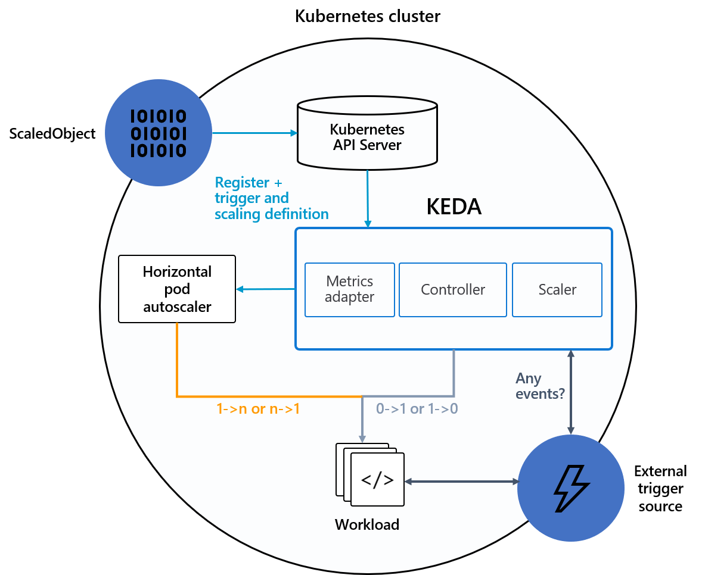
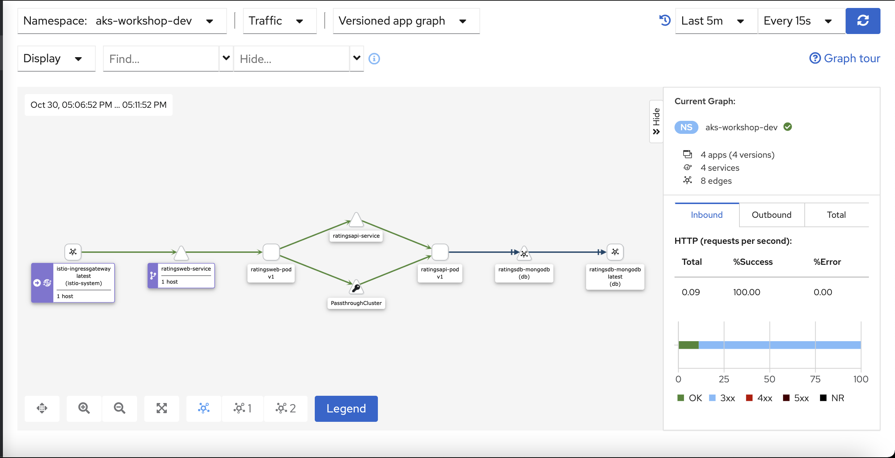
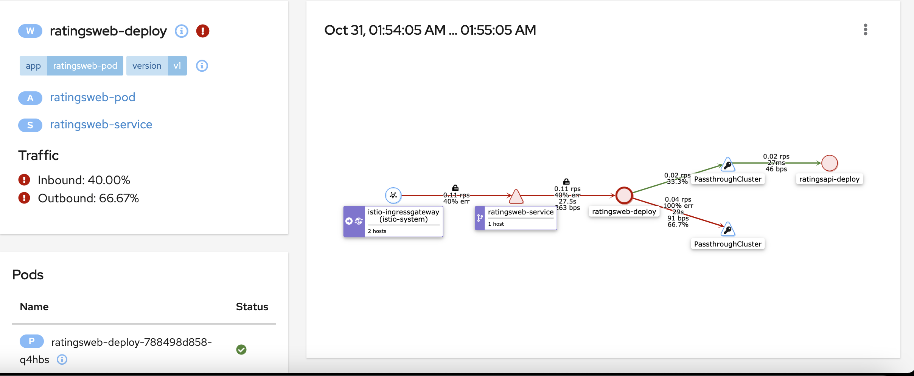
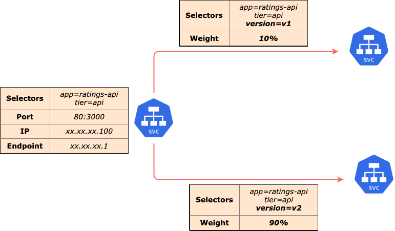

# AKS HOL - Advanced to Pro

## Introduction

## Purpose

## Pre-Requisites


- Gone thru the exercises of Basic to Advanced

- AKS cluster already created

- 3 Namespaces created

  - aks-workshop-dev
  - aks-workshop-qa
  - smoke

- Applications Deployed
  - Ratings App (DEV and QA)
  - Nginx App (Smoke)

- Nginx Ingress Controller deployed; with Private IP

- API routing is happening thru K8s Ingress rules

- Network Policies deployed for East-West traffic
  - Successfully Tested with various configurations

- Monitoring enabled
  - Azure Monitor
  - Log Analytics
  - Grafana (Integrated with Azure Monitor)

- End to End connectivity established
  - Application Gateway as Public facing L7 LoadBalancer
  - Multi-Tenancy implemnented tru Application Gateway Listeners and Http Settings

- Load Testing
  - JMeter Local

  - JMX files created for RatingsApi app 

  - HPA for RatingsApi enabled

  - Successfully Tested with Load

    

## HOL

- **Local Variables**

  ```bash
  baseFolderPath=""
  setupFolderPath="$baseFolderPath/Setup"
  microservicesFolderPath="$baseFolderPath/Microservices"
  tenantId=""
  subscriptionId=""
  aksResourceGroup="aks-train-rg"
  masterResourceGroup="master-workshop-rg"
  location="eastus"
  clusterName="aks-train-cluster"
  version="1.20.7"
  acrName="akstrnacr"
  acrId=
  keyVaultName="aks-train-kv"
  keyvaultId=
  masterVnetName="master-workshop-vnet"
  masterVnetPrefix="11.0.0.0/16"
  masterVnetId=
  masterSubnetName="master-js-ubuntuvm-subnet"
  masterSubnetPrefix="11.0.1.32/27"
  masterSubnetId=
  aksVnetName="aks-train-vnet"
  aksVnetPrefix="18.0.0.0/21"
  aksVnetId=
  aksSubnetName="aks-train-subnet"
  aksSubnetPrefix="18.0.0.0/24"
  aksSubnetId=
  aksIngressSubnetName="aks-train-ingress-subnet"
  aksIngressSubnetPrefix="18.0.1.0/24"
  aksIngressSubnetId=
  aksServicePrefix="18.0.2.0/24"
  dnsServiceIP="18.0.2.10"
  appgwName="aks-train-appgw"
  appgwSubnetName="aks-train-appgw-subnet"
  appgwSubnetPrefix="18.0.3.0/27"
  appgwSubnetId=
  apimName=""
  apimSubnetName=""
  apimSubnetPrefix=""
  apimSubnetId=
  sysPoolName=akssyspool
  sysPoolNodeSize="Standard_DS2_v2"
  sysPoolNodeCount=3
  sysPoolMaxPods=30
  sysPoolMaxNodeCount=5
  apiPoolName=aksapipool
  apiPoolNodeSize="Standard_DS2_v2"
  apiPoolNodeCount=3
  apiPoolMaxPods=30
  apiPoolMaxNodeCount=5
  networkPlugin=azure
  networkPolicy=azure
  vmSetType=VirtualMachineScaleSets
  osType=Linux
  addons=monitoring
  masterAKSPeering="$masterVnetName-$aksVnetName-peering"
  aksMasterPeering="$aksVnetName-$masterVnetName-peering"
  masterPrivateDNSLink="$masterVnetName-dns-plink"
  aksPrivateDNSLink="$aksVnetName-dns-plink"
  aksIngControllerName="aks-train-ing"
  aksIngControllerNSName="$aksIngControllerName-ns"
  aksIngControllerFileName="internal-ingress"
  aksIngControllerFilePath="$baseFolderPath/Setup/Common/internal-ingress.yaml"
  privateDNSZoneName=""
  privateDNSZoneId=
  backendIpAddress=
  aadAdminGroupIDs=""
  aadTenantID=""
  objectId=""
  spAppId=""
  spPassword=""
  logWorkspaceName="aks-train-lw"
  lwResourceGroup="monitoring-workshop-rg"
  ```

- **Login to Azure**

  ```bash
  az login --tenant $tenantId
  
  #Check Selected Subscription
  az account show
  
  #Set appropriate Subscription, if needed
  #az account set -s $subscriptionId
  ```

- **API Management**

  

  - Install API Management through Azure Portal

  - Move APIM into a Subnet (already created in previous exercise)
    - A private IP is assigned to APIM instance

  - A Custom Domian for APIM is configured
    - Using a proper DNS certificate
    - LetsEncrypt Certificates can also be used

  - Modify Application Gateway backend pool to point to this Private IP
    (Earlier it was pointing to Private IP of Nginx Ingress)

    - Modify Http Settings of Application Gateway to point all traffic to APIM
    - Modify Health Probe accordingly
    - Define APIs behind APIM
    - Check end-to-end connectivity

  - Configure OAuth for APIM
    - Configure APIs with OAuth definition
    - Add Policies for JWT header validation
    - Authenticate Each API
    - Generate Bearer Token by making a call to Azure AD Graph API (POSTMAN or any REST client can be used)
    - Pass this Token with the Authorization header of each API call
    - APIM policies should allow/reject API calls accordingly

  - Check end-to-end connectivity

  - Enable Application Insights in APIM

  - Check Metrics in Azure Portal

    

- **KEDA**

  

  

  - Event Driven Autoscaler
  - Scaling of any container in Kubernetes based on the number of events needing to be processed
  - Single-purpose and lightweight component 
  - Can be added into any Kubernetes cluster
  - Works alongside standard Kubernetes components like the [Horizontal Pod Autoscaler](https://kubernetes.io/docs/tasks/run-application/horizontal-pod-autoscale/)
  - Can extend functionality without overwriting or duplication
  - **How It Works**
    - Refer [Here](https://keda.sh/docs/2.1/concepts/)
    - **Agent** — Activates and Deactivates Kubernetes Deployments to scale to and from zero on no events. This is one of the primary roles of the `keda-operator` container that runs when you install KEDA.
    - **Metrics** — KEDA acts as a [Kubernetes metrics server](https://kubernetes.io/docs/tasks/run-application/horizontal-pod-autoscale/#support-for-custom-metrics) that exposes rich event data like queue length or stream lag to the Horizontal Pod Autoscaler to drive scale out. It is up to the Deployment to consume the events directly from the source. This preserves rich event integration and enables gestures like completing or abandoning queue messages to work out of the box. The metric serving is the primary role of the `keda-operator-metrics-apiserver` container that runs when you install KEDA.

  ```bash
  #Kubernetes based Event Driven AutoScaling - Severless, Event Driven Apps
  
  Refer Here - https://keda.sh/docs/2.4/deploy/
  
  #Add Helm repo
  helm repo add kedacore https://kedacore.github.io/charts
  
  #Update Helm repo
  helm repo update
  
  #Install keda Helm chart
  kubectl create namespace keda
  helm install keda kedacore/keda --namespace keda
  
  #Create Namespace for Serverless apps
  kubectl create ns serverless
  
  #Create a Storage Account in Azure Portal - kedateststg
  #Create a Blob Container in Azure Portal - kedablob
  #Create a Queue Container in Azure Portal - kedaqueue
  
  #Note down the Connection String of the storage account
  #This would be added as K8s secret inside the AKS cluster
  kubetcl create secret generic keda-stg-secret -n serverless --from-literal=AzureWebJobsStorage="<Blob-Connection-String>"
  
  ================================================================================
  
  #ACIBlobApp
  ================================================================================
  #Deploy ACIBlobApp in serverless namespace
  #App reacts to Blob events
  helm install aciblobapp-chart -n serverless $microservicesFolderPath/Helms/aciblobapp-chart/ -f $microservicesFolderPath/Helms/aciblobapp-chart/AKSWorkshop/values-dev.yaml
  
  #helm upgrade aciblobapp-chart -n serverless $microservicesFolderPath/Helms/aciblobapp-chart/ -f $microservicesFolderPath/Helms/aciblobapp-chart/AKSWorkshop/values-dev.yaml
  #helm uninstall aciblobapp-chart -n serverless
  
  #Check if app is deployed and no. of replicas running
  kubectl get all -n serverless
  
  #Modify the values-dev.yaml file to update placeholder values
  
  #Deploy KEDA objects in serverless namespace
  #These objects would ensure that the application scales based on Blob trigger
  helm install aciblobapp-chart -n serverless $microservicesFolderPath/Helms/aciblobapp-keda-chart/ -f $microservicesFolderPath/Helms/aciblobapp-keda-chart/AKSWorkshop/values-dev.yaml
  
  #helm upgrade aciblobapp-chart -n serverless $microservicesFolderPath/Helms/aciblobapp-keda-chart/ -f $microservicesFolderPath/Helms/aciblobapp-keda-chart/AKSWorkshop/values-dev.yaml
  #helm uninstall aciblobapp-chart -n serverless
  
  #Keep adding large no. of images into Blob Container
  #Check ACIBlobApp deployment on AKS cluster
  #Watch how replicas are scaling up and down
  
  
  #ACIQueueApp
  ================================================================================
  #Deploy ACIQueueApp in serverless namespace
  #App reacts to Blob events
  helm install aciqueueapp-chart -n serverless $microservicesFolderPath/Helms/aciqueueapp-chart/ -f $microservicesFolderPath/Helms/aciqueueapp-chart/AKSWorkshop/values-dev.yaml
  
  #helm upgrade aciqueueapp-chart -n serverless $microservicesFolderPath/Helms/aciqueueapp-chart/ -f $microservicesFolderPath/Helms/aciqueueapp-chart/AKSWorkshop/values-dev.yaml
  #helm uninstall aciqueueapp-chart -n serverless
  
  #Check if app is deployed and no. of replicas running
  kubectl get all -n serverless
  
  #Modify the values-dev.yaml file to update placeholder values
  
  #Deploy KEDA objects in serverless namespace
  #These objects would ensure that the application scales based on Blob trigger
  helm install aciqueueapp-chart -n serverless $microservicesFolderPath/Helms/aciqueueapp-keda-chart/ -f $microservicesFolderPath/Helms/aciqueueapp-keda-chart/AKSWorkshop/values-dev.yaml
  
  #helm upgrade aciblobapp-chart -n serverless $microservicesFolderPath/Helms/aciqueueapp-keda-chart/ -f $microservicesFolderPath/Helms/aciqueueapp-keda-chart/AKSWorkshop/values-dev.yaml
  #helm uninstall aciqueueapp-chart -n serverless
  
  #Keep adding large no. of messages into Queue Container
  #Check ACIQueueApp deployment on AKS cluster
  #Watch how replicas are scaling up and down
  
  ================================================================================
  
  #Uninstall KEDA
  #helm uninstall keda -n keda
  ```

- **Azure Policy**

  - Refer [Policy Reference](https://docs.microsoft.com/en-us/azure/aks/policy-reference)

  - Refer [Policy for K8s](https://docs.microsoft.com/en-us/azure/governance/policy/concepts/policy-for-kubernetes)

    

- **Service Mesh**

  - What it is?

    

  - **Features**

    - Observability
    - Distributed Tracing
    - Traffic Splitting
    - Blue/Green deployment
    - Fault Injection
    - Circuit Breaking
    - Multi Cluster
      - Traffic Mirroring or Shadowing
      - Multi Cluster Connecitivity

  - Remove Nginx Ingress Controller
    - The in-built Ingress Gateway from Service mesh would be used

  - **Set CLI Variables for Istio**

    ```bash
    primaryResourceGroup=$aksResourceGroup
    primaryClusterName="primary-mesh-cluster"
    secondaryResourceGroup="secondary-workshop-rg"
    secondaryClusterName="secondary-mesh-cluster"
    primaryAcrName=$acrName
    istioPath="$microservicesFolderPath/Istio"
    
    #Set Env Variable for Primary Cluster
    #This helps to switch context easily between multiple clusters
    export CTX_CLUSTER1=primary
    
    #Connect to Public AKS Cluster with Primary Context
    az aks get-credentials -g $primaryResourceGroup -n $primaryClusterName --context $CTX_CLUSTER1
    ```

  - **Download Istio**

    ```bash
    #Download Istio binary
    curl -L https://istio.io/downloadIstio | sh -
    
    #Download specific version of Istio viz. 1.11.3
    curl -L https://istio.io/downloadIstio | ISTIO_VERSION=1.11.3 TARGET_ARCH=x86_64 sh -
    
    #The istioctl client binary in the bin/ directory
    #Add the istioctl client to your path (Linux or macOS):
    export PATH=$PWD/bin:$PATH
    ```

  - **Install and Configure Istio**

    ```bash
    #Create namespaces for Istio
    kubectl create namespace istio-system --context $CTX_CLUSTER1
    kubectl create namespace primary --context $CTX_CLUSTER1
    
    #Install Istio CLI
    #Select Default Istio Profile settings
    #Ingress Gateway with Public IP Address
    istioctl install --context=$CTX_CLUSTER1 --set profile=default -y
    
    #Install Istio with custom configurations
    #Ingress Gateway with Privae IP Address
    #Another Publicly exposed LoadBalancer Service(L7) would be needed to access this Private IP
    istioctl install --context=$CTX_CLUSTER1 -f $istioPath/Components/values-primary.yaml -y
    
    #Inject Istio into primary namespace
    #Ensures sidecar container to be added for every deployment in this namespace
    kubectl label namespace primary istio-injection=enabled --context=$CTX_CLUSTER1
    
    #Disable sidecar injection from primary namespace
    #kubectl label namespace primary istio-injection=disabled --context=$CTX_CLUSTER1
    
    #Install Istio Addons
    #This primarily installs all dependencies for observability by Istio viz. Grafana, Kiali dashboard etc.
    kubectl apply -f $istioPath/Components/samples/addons --context=$CTX_CLUSTER1
    
    #Check rollout status of the Kiali deployment - usually takes sometime
    kubectl rollout status deployment/kiali -n istio-system
    
    #Check Deployments within istio-system
    #Istio Ingress gateway with public or private IP
    kubectl get svc -n istio-system
    
    #Need a Gateway to expose the Kiali service outside
    #Check Routing definitions
    #Replace <dns-name>
    kubectl apply -f $istioPath/Examples/Networking/kiali-gateway.yaml -n istio-system --context=$CTX_CLUSTER1
    
    #Modify Application Gateway to accommodate Kiali Gateway to access Kiali Services
    Configure Private DNS Zone for Kiali Gateway with Istio Ingress Gateway IP
    Add Listener for Kiali Gateway
    Add Http Settings for Kiali Gateway
    Add Rules for Kiali Gateway Listener
    
    #Launch Kiali in the browser
    curl -k https://kiali-<appgw-dns-name>/
    ```

  - **Observability**

    

    

    

    

    ```bash
    #Deploy Apps to view in Istio
    
    #Install BookInfo app onto the cluster
    kubectl apply -f $istioPath/Examples/BookInfo/bookinfo.yaml -n primary --context=$CTX_CLUSTER1
    
    #Check Deployed Components
    kubectl get svc -n primary --context=$CTX_CLUSTER1
    kubectl get pods -n primary --context=$CTX_CLUSTER1
    
    #Quick check to test BookInfo app
    podName=$(kubectl get pod -l app=ratings -n primary -o jsonpath='{.items[0].metadata.name}')
    kubectl exec $podName -n primary -c ratings -- curl -sS productpage:9080/productpage | grep -o "<title>.*</title>"
    
    #Need a Gateway to expose the service outside
    #Check Routing definitions
    #Replace <dns-name>
    kubectl apply -f $istioPath/Examples/Networking/primary-gateway.yaml -n primary --context=$CTX_CLUSTER1
    
    #Get GATEWAY_URL
    kubectl get svc istio-ingressgateway -n istio-system
    export INGRESS_HOST=$(kubectl -n istio-system get service istio-ingressgateway -o jsonpath='{.status.loadBalancer.ingress[0].ip}')
    export INGRESS_PORT=$(kubectl -n istio-system get service istio-ingressgateway -o jsonpath='{.spec.ports[?(@.name=="http2")].port}')
    export SECURE_INGRESS_PORT=$(kubectl -n istio-system get service istio-ingressgateway -o jsonpath='{.spec.ports[?(@.name=="https")].port}')
    
    #Call services using GATEWAY_URL
    export GATEWAY_URL=$INGRESS_HOST:$INGRESS_PORT
    echo "$GATEWAY_URL"
    
    #Modify Application Gateway to accommodate RatingsApp Gateway to access RatingsApp Services
    Configure Private DNS Zone for RatingsApp Gateway with Istio Ingress Gateway IP
    Add Listener for RatingsApp Gateway
    Add Http Settings for RatingsApp Gateway
    Add Rules for RatingsApp Gateway Listener
    
    #Try the follwoing URL in the Browser or do a cUrl
    curl -k https://ratings-<appgw-dns-name>/
    ```

  - **Traffic Shifting**

    

    ```bash
    #Traffic Shifting
    kubectl apply -f $istioPath/Examples/HelloWorld/helloworld-app.yaml -n primary --context=$CTX_CLUSTER1
    kubectl get po -n primary --context=$CTX_CLUSTER1
    
    #Check Routing definitions
    kubectl apply -f $istioPath/Examples/Networking/primary-gateway.yaml -n primary --context=$CTX_CLUSTER1
    
    #Destination Rule
    kubectl apply -f $istioPath/Examples/Networking/helloworld-destination-rule.yaml -n primary --context=$CTX_CLUSTER1
    
    kubectl apply -f $istioPath/Examples/HelloWorld/helloworld-app-v2.yaml -n primary --context=$CTX_CLUSTER1
    kubectl get po -n primary --context=$CTX_CLUSTER1
    
    #Check Routing behaviour
    #UNCOMMENT: Test Traffic Shifting
    #Update Primary Gateway Routes - Change Traffic weight
    kubectl apply -f $istioPath/Examples/Networking/primary-gateway.yaml -n primary --context=$CTX_CLUSTER1
    
    #Destination Rule
    kubectl apply -f $istioPath/Examples/Networking/helloworld-destination-rule.yaml -n primary --context=$CTX_CLUSTER1
    
    #Check Routing behaviour again
    ```

  - **Blue/Green**

    

    ```bash
    #Blue/Green
    #Deploy PodInfo Blue
    kubectl apply -f $istioPath/Examples/BlueGreen/podinfo-blue.yaml -n primary --context=$CTX_CLUSTER1
    
    #Check Routing definitions
    kubectl apply -f $istioPath/Examples/Networking/primary-gateway.yaml -n primary --context=$CTX_CLUSTER1
    
    #Destination Rule
    kubectl apply -f $istioPath/Examples/Networking/podinfo-destination-rule.yaml -n primary --context=$CTX_CLUSTER1
    
    #Deploy PodInfo green
    kubectl apply -f $istioPath/Examples/BlueGreen/podinfo-green.yaml -n primary --context=$CTX_CLUSTER1
    
    #Check Routing behaviour
    #UNCOMMENT: Test Blue/Green
    #Update Primary Gateway Routes - Change Traffic weight
    kubectl apply -f $istioPath/Examples/Networking/primary-gateway.yaml -n primary --context=$CTX_CLUSTER1
    
    #Destination Rule
    kubectl apply -f $istioPath/Examples/Networking/podinfo-destination-rule.yaml -n primary --context=$CTX_CLUSTER1
    
    #Check Routing behaviour again
    ```

  - **Fault Injection**

    

    ```bash
    #Fault Injection
    #Deploy Fault in Ratinsg API
    kubectl apply -f $istioPath/Examples/Network/ratingsfault-virtual-service.yaml -n primary --context=$CTX_CLUSTER1
    
    #Check Comments in the file
    #Introduce Delay
    #Check Routing behaviour
    
    #Introduce Fix
    kubectl apply -f $istioPath/Examples/Networking/reviewsfix-virtual-service.yaml -n primary --context=$CTX_CLUSTER1
    
    #Check Comments in the file
    #Check Routing behaviour
    ```

  - **Circuit Breaker**

    ```bash
    #Circuit Breaker
    #Deploy HttpBin App
    kubectl apply -f $istioPath/Examples/HttpBin/httpbin.yaml -n primary --context=$CTX_CLUSTER1
    kubectl apply -f $istioPath/Examples/Networking/httpbin-gateway.yaml -n primary --context=$CTX_CLUSTER1
    
    #Deploy HttpBin Destination Rule
    kubectl apply -f $istioPath/Examples/Networking/httpbin-destination-rule.yaml -n primary --context=$CTX_CLUSTER1
    
    #Check Routing behaviour
    #UNCOMMENT: Test Circuit Breaking
    kubectl apply -f $istioPath/Examples/Networking/primary-gateway.yaml -n primary --context=$CTX_CLUSTER1
    
    #Generate Load - e.g. JMeter or Fortio or any other Laod Testing client
    
    #Deploy Fortio client
    kubectl apply -f $istioPath/Examples/HttpBin/sample-client/fortio-deploy.yaml -n primary --context=$CTX_CLUSTER1
    
    #Make calls from Fortio client
    export FORTIO_POD=$(kubectl get pods -l app=fortio -o 'jsonpath={.items[0].metadata.name}')
    kubectl exec "$FORTIO_POD" -c fortio -- /usr/bin/fortio curl -quiet http://httpbin:8000/get
    
    #Check Routing behaviour
    #Observer many calls being failed and circuit is broken and joined automatically
    #Change parameters in the $istioPath/Examples/Networking/httpbin-destination-rule.yaml file
    #Play around and see the chnage in the behaviour
    ```

  - **Service Mirroring or Shadowing**

    

    

    

    

    ```bash
    #Service Mirroring or Shadowing
    #Create Secondary Cluster - CLI or Portal
    export CTX_CLUSTER2=secondary
    
    #Connect to Public AKS Cluster with Primary Context
    az aks get-credentials -g $primaryResourceGroup -n $secondaryClusterName --context $CTX_CLUSTER2
    
    kubectl config use-context $CTX_CLUSTER2
    
    #Check Cluster Health - Secondary
    kubectl get no --context=$CTX_CLUSTER2
    kubectl get ns --context=$CTX_CLUSTER2
    kubectl create namespace istio-system --context $CTX_CLUSTER2
    kubectl create namespace secondary --context $CTX_CLUSTER2
    
    #Install Istio CLI
    #Select Default Istio Profile settings
    #Ingress Gateway with Public IP Address
    istioctl install --context=$CTX_CLUSTER2 --set profile=default -y
    
    #Install Istio with custom configurations
    #Ingress Gateway with Privae IP Address
    #Another Publicly exposed LoadBalancer Service(L7) would be needed to access this Private IP
    istioctl install --context=$CTX_CLUSTER2 -f $istioPath/Components/values-secondary.yaml -y
    
    #Inject Istio into Secondary namespace of the cluster 
    #This ensures sidecar container to be added for every deployment in this namespace
    kubectl label namespace secondary istio-injection=enabled --context=$CTX_CLUSTER2
    
    #Install Istio Addons
    #This primarily installs all dependencies for observability by Istio viz. Grafana, Kiali dashboard etc.
    kubectl apply -f $istioPath/Components/samples/addons --context=$CTX_CLUSTER2
    
    kubectl get svc istio-ingressgateway -n istio-system
    export INGRESS_HOST=$(kubectl -n istio-system get service istio-ingressgateway -o jsonpath='{.status.loadBalancer.ingress[0].ip}')
    export INGRESS_PORT=$(kubectl -n istio-system get service istio-ingressgateway -o jsonpath='{.spec.ports[?(@.name=="http2")].port}')
    export SECURE_INGRESS_PORT=$(kubectl -n istio-system get service istio-ingressgateway -o jsonpath='{.spec.ports[?(@.name=="https")].port}')
    
    export GATEWAY_URL2=$INGRESS_HOST:$INGRESS_PORT
    echo "$GATEWAY_URL2"
    
    #Modify Application Gateway to accommodate Secondary Gateway to access Services deployed
    Configure Private DNS Zone for Secondary Gateway with Istio Ingress Gateway IP
    Add Listener for Secondary Gateway 
    Add Http Settings for Secondary Gateway
    Add Rules for Secondary Gateway Listener
    
    #Need a Gateway to expose deployed services outside
    #Check Routing definitions
    #Replace <dns-name>
    kubectl apply -f $istioPath/Examples/Networking/secondary-gateway.yaml -n secondary --context=$CTX_CLUSTER2
    
    kubectl apply -f $istioPath/Examples/HelloWorld/helloworld-app-v2.yaml -n secondary --context=$CTX_CLUSTER2
    kubectl get po -n secondary --context=$CTX_CLUSTER2
    
    #Destination Rule
    kubectl apply -f $istioPath/Examples/Networking/helloworld-v2-destination-rule.yaml -n secondary --context=$CTX_CLUSTER2
    
    kubectl get svc -n secondary --context=$CTX_CLUSTER2
    kubectl describe svc -n secondary --context=$CTX_CLUSTER2
    kubectl get svc -A --context=$CTX_CLUSTER2
    
    #Switch to the Primary Cluster
    kubectl config use-context $CTX_CLUSTER1
    
    #Check Routing definitions
    kubectl apply -f $istioPath/Examples/Networking/primary-gateway.yaml -n primary --context=$CTX_CLUSTER1
    
    #Deploy components so that Mirroring can work
    #Replace <dns-name>
    kubectl apply -f $istioPath/Examples/Networking/primary-serviceentry.yaml -n primary --context=$CTX_CLUSTER1
    
    #Destination Rule
    #Replace <dns-name>
    kubectl apply -f $istioPath/Examples/Networking/helloworld-destination-rule.yaml -n primary --context=$CTX_CLUSTER1
    
    kubectl get svc -n primary --context=$CTX_CLUSTER1
    kubectl describe svc -n primary --context=$CTX_CLUSTER1
    kubectl get svc -A --context=$CTX_CLUSTER1
    
    #Call helloworld-v1
    #Observe that all calls being replicated to helloworld-v2 of secondary cluster
    
    ```

  - **Cleanup**

    ```bash
    #Cleanup
    
    #Uninstall Istio setup - primary cluster
    istioctl x uninstall --set profile=default --purge --context=$CTX_CLUSTER1
    kubectl delete namespace istio-system --context=$CTX_CLUSTER1
    
    #Uninstall Istio setup - secondary cluster
    istioctl x uninstall --set profile=default --purge --context=$CTX_CLUSTER2
    kubectl delete namespace istio-system --context=$CTX_CLUSTER2
    ```

    
