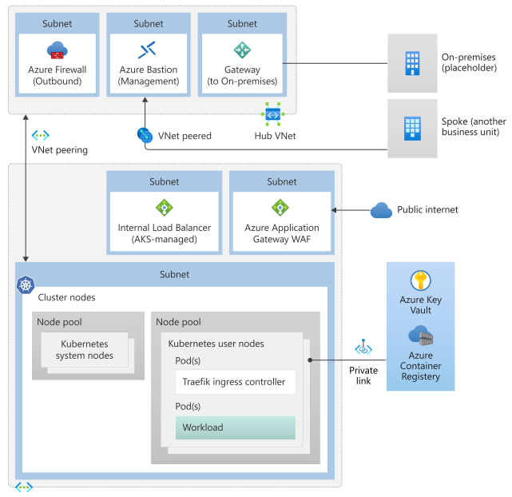

# AKS HOL - Basic to Advanced

## Introduction

## Purpose

## What to Accomplish

- ### Understand K8s High Level Architecture

- ### Understand AKS High Level Architecture

- ### Create AKS Cluster

- ### Deploy Microservices

- ### Cluster Configuration - Post Creation

- ### Maintenance

## Exclusions

- Enhanced Control of K8s cluster
  - K8s REST API
  - Admission Webhook; Validation Webhook
- Integration with APIM
- Integration with DevOps
- GitOps

## Implementation

- [**Understand K8s High Level Architecture**](#Understand K8s High Level Architecture)

  

- [**Understand AKS High Level Architecture**](#Understand AKS High Level Architecture)

  

  - **AKS Baseline architecture**

    

  - **Ancilliary components of AKS cluster**

    - Virtual Network
    - Azure Container Registry
    - Key Vault
    - Service Principal
    - Application Gateway

- [**Create AKS Cluster**](#Create AKS Cluster)

  - Cluster Sizing
  - AutoScaling
  - Authentication
  - Authorization
    - Azure AD
    - RBAC

- [**Deploy Microservices**](#Deploy Microservices)

  - **Deployment**
    - Versioning
    - Node Affinity/Anti-Affnity
    - Pod Affinity/Anti-Affnity
    - Pod DIsruption Budget (*PDB*)
  - **Service**
    - External Ingress
    - Internal Ingress
    - Network Policy - *East/West Security*
  - **Persistent Storage**
    - PeristentVolume
    - PeristentVolumeCaim
    - Persistence with Azure File
    - Persistence with Azure Disk
  
- [**Cluster Configuration - Post Creation**](#Cluster Configuration - Post Creation)

  - Install Nginx Ingress as *Internal LoadBalancer*
  - Deploy Application Gateway
    - SSL Offloading
    - Lock down external access to Microservices within the Cluster 

- [**Maintenance**](#Maintenance)

  - Monitoring

    - Azure Monitor
    - Azure Log Analytics
    - Load Testing 
      - JMeter Cluster
    
  - Cluster Upgrades

## References

